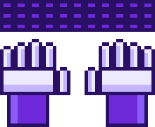

  

I build iOS apps in Swift and SwiftUI.

<h2 align="center">About Me</h2>

<ul>
  <li>I build <b>things people can actually use</b>.</li>
  <li>Code, design, product - <b>usually somewhere in between</b>.</li>
  <li>Currently exploring <b>Swift, SwiftUI &</b> and better ways to build.</li>
  <li>Weakness: <b>“I could probably build that.”</b></li>
  <li>Have an idea? I’ll probably build it.</li>
</ul>

 

<h2 align="center">Connect</h2>

  
  &nbsp;&nbsp;
  

<h2 align="center">Tech Stack</h2>

<b>iOS Development</b>

  
  
  
  
  
  
  

<b>Release and Tools</b>

  
  
  
  

<h2 align="center">Contribution Activity</h2>

  <picture>
    <source
      media="(prefers-color-scheme: dark)"
      srcset="https://raw.githubusercontent.com/Vedanshi-Prajapati/Vedanshi-Prajapati/output/pacman-contribution-graph-dark.svg"
    />
    <source
      media="(prefers-color-scheme: light)"
      srcset="https://raw.githubusercontent.com/Vedanshi-Prajapati/Vedanshi-Prajapati/output/pacman-contribution-graph.svg"
    />
    
  </picture>

<h2 align="center">Philosophy</h2>

  

 

